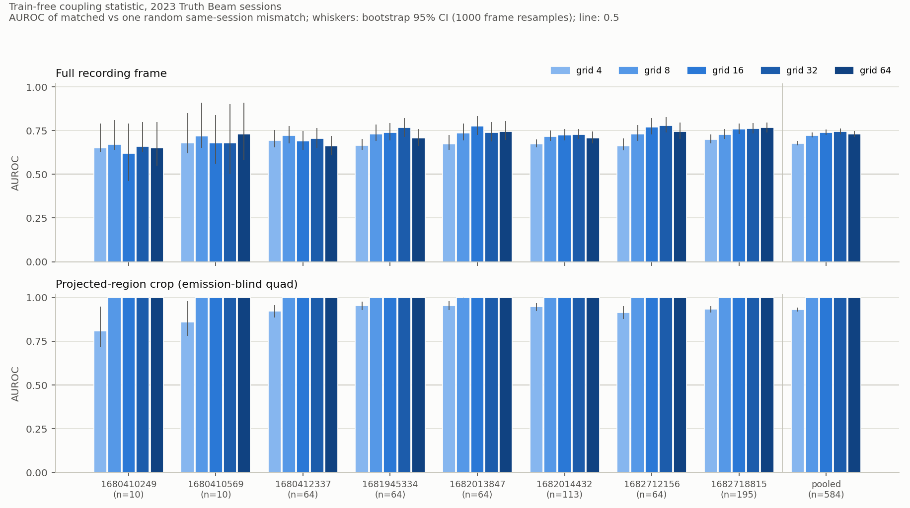
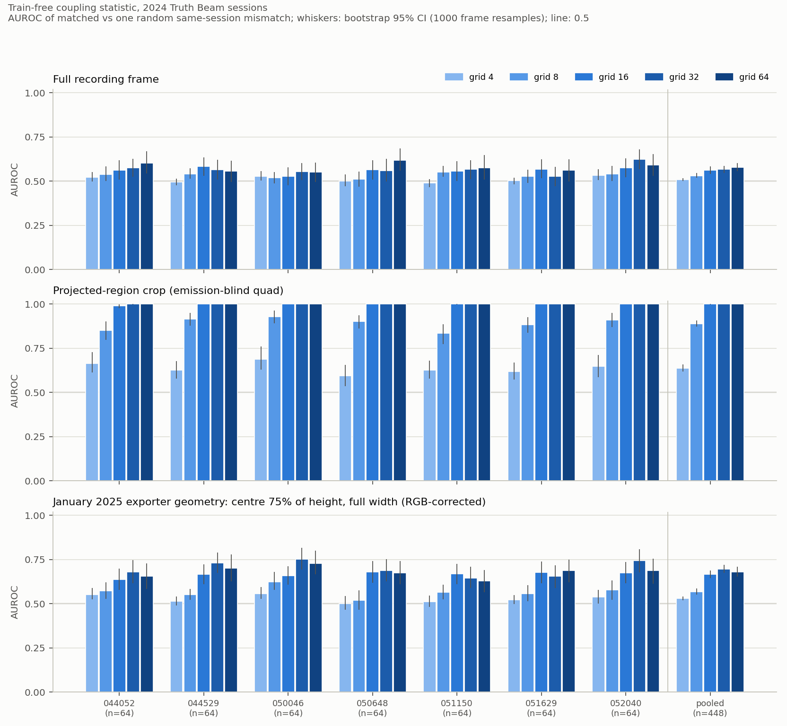
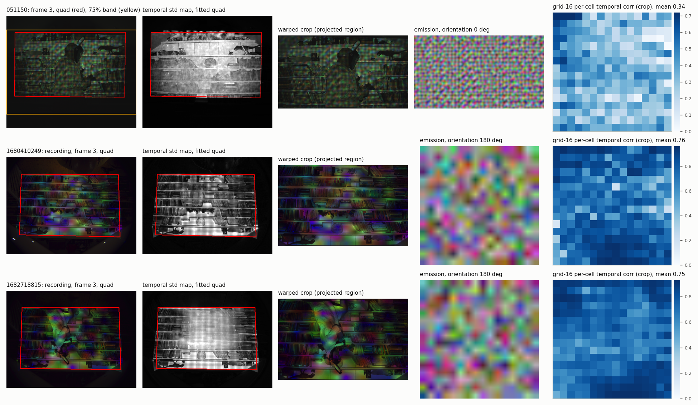

> Published copy of the desk report of 9 September 2026, as audited (`../AUDIT_TRAIL.md`). Every table and number is the
> desk's; the operational sentences are replaced and the machine paths read as package locators, as `../REDACTION.md` records.
> Paths are relative to this directory; `../` reaches the package root; `dark-lantern/...` names a file elsewhere in the
> Dark Lantern repository; `armi/`, `coupling/`, `oldlight/` and `supporting/data_look/*.png` name objects of the data-layer
> bundle (`../LARGE_FILES.md`). Read under `../CLAIM_BOUNDARY.md`.

# Train-free emission-capture coupling on the old Truth Beam sessions (2023 and 2024)

This is the *No Training Required* (6 September 2026) train-free coupling statistic, run with the same definitions on
the public 2023 NumPy sessions and the December 2024 HDF5 sessions. The statistic code is the reference implementation
(`the repository's `results/train_free_coupling_20260906/scripts/coupling_stat.py``) with only the loaders and the geometry adapted; every adaptation is listed in
section 5. Numbers in this report are read by `code/write_report.py` from `results/2023_results.json` and
`results/2024_results.json`; per-frame scores are in `results/<era>_scores.csv` and the mismatch partner maps in
`results/<era>_partners.json`. Generated 2026-09-09T04:59Z.

**What this is and is not.** A random-negative correspondence test: does the statistic tell the matched
(emission, capture) pair from the same emission paired with the capture of one other randomly chosen frame of the same
session? It is not a quality score, a liveness test, or a security claim. The negative is one random same-session
frame; harder temporal or adversarial alternatives remain untested.

## 1. Headline: pooled AUROC per era by grid, full frame and projected-region crop

| era | variant | grid 4 | grid 8 | grid 16 | grid 32 | grid 64 | n pairs |
|---|---|---|---|---|---|---|---|
| 2023 | full | **0.6771** [0.666, 0.690] | **0.7232** [0.710, 0.739] | **0.7399** [0.725, 0.756] | **0.7440** [0.729, 0.762] | **0.7294** [0.715, 0.747] | 584 |
| 2023 | crop | **0.9328** [0.922, 0.944] | **0.9999** [1.000, 1.000] | **1.0000** [1.000, 1.000] | **1.0000** [1.000, 1.000] | **1.0000** [1.000, 1.000] | 584 |
| 2023 | crop_bgr | **0.6745** [0.660, 0.692] | **0.8675** [0.852, 0.884] | **0.9742** [0.968, 0.980] | **0.9870** [0.982, 0.991] | **0.9858** [0.981, 0.990] | 584 |
| 2024 | full | **0.5089** [0.501, 0.517] | **0.5308** [0.519, 0.545] | **0.5608** [0.542, 0.583] | **0.5665** [0.546, 0.586] | **0.5781** [0.556, 0.601] | 448 |
| 2024 | crop | **0.6373** [0.618, 0.659] | **0.8886** [0.872, 0.907] | **0.9988** [0.998, 1.000] | **1.0000** [1.000, 1.000] | **1.0000** [1.000, 1.000] | 448 |
| 2024 | export75 | **0.5291** [0.519, 0.540] | **0.5665** [0.551, 0.585] | **0.6653** [0.646, 0.687] | **0.6956** [0.673, 0.721] | **0.6791** [0.652, 0.708] | 448 |
| 2024 | crop_bgr | **0.5535** [0.533, 0.575] | **0.6651** [0.643, 0.690] | **0.8942** [0.877, 0.913] | **0.9769** [0.968, 0.984] | **0.9847** [0.977, 0.991] | 448 |
| 2024 | export75_bgr | **0.5125** [0.502, 0.523] | **0.5283** [0.512, 0.545] | **0.5680** [0.547, 0.589] | **0.5790** [0.556, 0.604] | **0.5684** [0.544, 0.593] | 448 |

Bold: pooled AUROC; brackets: bootstrap 95% CI, 1000 resamples of frames (each frame carries its matched and its mismatched score). Variants: `full` = whole recording frame; `crop` = projected-region quad estimated from the recordings alone (no emission values, no pair labels); `export75` (2024 only) = an approximate reproduction of the January 2025 exporter's geometry, the centre 75 percent of the recording height at full width, RGB-corrected, without the exporter's resize to 2048x1024 (the resize is not numerically invariant for the grid statistic: one checked grid-16 mismatch score moves by 0.005); `crop_bgr` = the crop with the recording's channels reversed, a colour-sensitivity variant that keeps the spatial information (for 2024 this is the stored BGR order left unflipped against the RGB emission, the exporter's actual pairing; for 2023 it reverses the stored RGB report); `export75_bgr` = the exporter geometry in its stored byte order. Source: `results/<era>_results.json` -> grids.<g>.<variant>.pooled.

### Paired fraction (matched > mismatched) and shuffled-label control, pooled

| era | variant | grid 4 | grid 8 | grid 16 | grid 32 | grid 64 |
|---|---|---|---|---|---|---|
| 2023 | full | 571/584; ctrl 0.484 (null 0.471-0.535) | 560/584; ctrl 0.485 (null 0.468-0.536) | 544/584; ctrl 0.480 (null 0.469-0.534) | 548/584; ctrl 0.481 (null 0.469-0.533) | 531/584; ctrl 0.469 (null 0.468-0.536) |
| 2023 | crop | 583/584; ctrl 0.490 (null 0.466-0.530) | 584/584; ctrl 0.483 (null 0.465-0.531) | 584/584; ctrl 0.486 (null 0.466-0.532) | 584/584; ctrl 0.490 (null 0.466-0.532) | 584/584; ctrl 0.481 (null 0.466-0.532) |
| 2023 | crop_bgr | 497/584; ctrl 0.498 (null 0.468-0.532) | 563/584; ctrl 0.476 (null 0.465-0.533) | 580/584; ctrl 0.486 (null 0.466-0.531) | 583/584; ctrl 0.490 (null 0.466-0.533) | 584/584; ctrl 0.486 (null 0.467-0.532) |
| 2024 | full | 240/448; ctrl 0.521 (null 0.463-0.540) | 273/448; ctrl 0.521 (null 0.464-0.538) | 274/448; ctrl 0.507 (null 0.461-0.537) | 267/448; ctrl 0.490 (null 0.462-0.536) | 276/448; ctrl 0.488 (null 0.461-0.537) |
| 2024 | crop | 346/448; ctrl 0.510 (null 0.461-0.540) | 433/448; ctrl 0.516 (null 0.461-0.539) | 448/448; ctrl 0.517 (null 0.463-0.541) | 448/448; ctrl 0.525 (null 0.461-0.540) | 448/448; ctrl 0.514 (null 0.463-0.540) |
| 2024 | export75 | 289/448; ctrl 0.514 (null 0.463-0.540) | 303/448; ctrl 0.505 (null 0.463-0.538) | 334/448; ctrl 0.521 (null 0.463-0.536) | 353/448; ctrl 0.535 (null 0.462-0.538) | 341/448; ctrl 0.512 (null 0.463-0.535) |
| 2024 | crop_bgr | 271/448; ctrl 0.510 (null 0.461-0.541) | 346/448; ctrl 0.503 (null 0.461-0.537) | 424/448; ctrl 0.505 (null 0.462-0.539) | 444/448; ctrl 0.517 (null 0.462-0.539) | 443/448; ctrl 0.506 (null 0.463-0.538) |
| 2024 | export75_bgr | 251/448; ctrl 0.513 (null 0.463-0.541) | 261/448; ctrl 0.496 (null 0.463-0.539) | 284/448; ctrl 0.509 (null 0.462-0.539) | 296/448; ctrl 0.508 (null 0.462-0.536) | 277/448; ctrl 0.497 (null 0.463-0.536) |

`wins/n`: frames whose matched statistic exceeds their mismatched one. `ctrl`: AUROC after one seeded shuffle of the matched/mismatched labels; `null`: 2.5-97.5 percentiles of 1000 such shuffles. The label shuffle relabels already computed scores, so a chance result checks the scoring machinery; it cannot exclude upstream leakage or temporal confounding. Source: `results/<era>_results.json` -> pooled.control.

### Best grid and per-session range

- 2023, full: best grid 32 (pooled 0.7440); per-session AUROC at that grid from 0.660 (1680410249, n=10) to 0.778 (1682712156, n=64).
- 2023, crop: best grid 16 (pooled 1.0000); every session 1.000 at that grid.
- 2024, full: best grid 64 (pooled 0.5781); per-session AUROC at that grid from 0.552 (050046, n=64) to 0.619 (050648, n=64).
- 2024, crop: best grid 64 (pooled 1.0000); every session 1.000 at that grid.
- 2024, export75: best grid 32 (pooled 0.6956); per-session AUROC at that grid from 0.646 (051150, n=64) to 0.751 (050046, n=64).

## 1b. Verdict: what is shelf material

**Supported claim: frame-by-frame correspondence between emission and recording against the chosen random same-session negatives, with projected-region alignment.** With the crop, the statistic preferred the correct recording to one random same-session alternative in every tested comparison at grid 8 for April 2023 (584/584 paired wins, pooled AUROC 0.9999) and at grid 16 for December 2024 (448/448, pooled AUROC 0.9988). At grid 16 the lowest 2024 session is 044052 at 0.9895; at grids 32 and 64 every session rounds to 1.000 and the December grid-32 pooled value is 0.99996, which the tables round to 1.0000. **At grid 16, aligning the projected region raises pooled AUROC from 0.740 to 1.000 in April and from 0.561 to 0.999 in December.** The preprocessing is part of the finding.

**Shelf entry.** No Training Required, archival repeat: with projected-region alignment, a fixed calculation preferred the correct recording to one random same-session alternative in all 1,032 tested comparisons across 15 sessions, with no trained model.

**Plain English.** We compared 584 April 2023 and 448 December 2024 projected patterns with their corresponding camera recordings. After aligning the lit area, a fixed calculation preferred the correct recording over one randomly chosen alternative from the same session in every tested comparison, using an 8x8 grid for April and 16x16 for December. No training or model was involved. This shows frame-by-frame correspondence between the projected patterns and these recordings. It does not measure image quality or establish liveness, realness, or proof of physical capture. Comparing the whole camera image gave much weaker results, so alignment is an essential part of the finding.

**What supports the claim, and what it does not settle.**

1. The quad is estimated without emission values or pair labels (section 5, G2): one shared transform per session, no pair-specific optimisation. That is a statement about how the geometry was obtained; it does not establish optimal alignment and does not eliminate every source of retrospective optimism. The orientation (0 or 180 degrees) is chosen on four matched pairs that also enter the evaluation, and the geometry method was developed iteratively on these same sessions (the desk's run log, on-box). Excluding every comparison that touches an orientation-calibration frame leaves 522/522 April grid-8 wins and 394/394 December grid-16 wins.
2. The negative is the reference construction unchanged: for each frame, the recording of one other frame of the same session, chosen by `random.seed(0)` and one shuffle per grid per session, with the reference's fixed-point repair (a recording can serve as the negative for more than one frame; this is not a one-to-one derangement), shared by every geometry variant of that grid (`results/<era>_partners.json`). Most negatives are distant frames (13 of 448 December grid-16 partners are immediate neighbours). Shared scene, exposure and the moving person are not independently controlled; nothing in the record shows they manufactured the result, and harder temporal or adversarial negatives are untested.
3. The shuffled-label control sits at chance in every cell (one seeded shuffle 0.469 to 0.535 across all grids and variants; 1000-permutation null bands 0.461 to 0.541). It relabels already computed scores, so it checks the scoring machinery, not upstream leakage. The channel-swap variant (`crop_bgr`) tests colour sensitivity and keeps the spatial information; it is not a chance-level null.
4. The refinement check (section 4b) is a limited sensitivity check, not a proof that no alignment improvement remains: on 051150 an emission-informed quad raises grid-8 AUROC from 0.875 to 0.893 while paired wins fall from 32/32 to 30/32, and the saturated grids 16 and 32 cannot show a difference either way.

**Positive but weaker, not shelf material on its own: the full-frame numbers** (2023 pooled 0.677 to 0.744; 2024 pooled 0.509 to 0.578). They are above chance with CIs clear of 0.5 (2024 grid 4 only just: 0.509 [0.501, 0.517]), and in 2023 the paired wins are still 560/584 at grid 8, but they measure the statistic through a misregistration.

**Relation to the 6 September result.** This extends the same statistic to older recordings. It is not a directly comparable improvement over the d2/v10 result (pooled 0.756 at grid 8, 902/975 paired), because both the recordings and the alignment handling differ (section 4c).

**The 2024 exporter geometry (coordinator's request).** The January 2025 exporter's centre-75-percent band does not coincide with the detected projected region (section 4a). Under an approximate reproduction of that geometry (without the exporter's resize) the statistic reaches 0.696 at grid 32 RGB-corrected and 0.579 with the exporter's unflipped BGR byte order; the channel swap alone moves the tight crop from 0.889 to 0.665 at grid 8 and from 0.999 to 0.894 at grid 16. A model trained on that export therefore saw pairs offset from the detected projected region and, in the stored byte order, colour-swapped.

## 2. Per-session results

### 2023: AUROC by grid (crop / full), orientation, n

| session | n | orientation | grid 4 crop / full | grid 8 crop / full | grid 16 crop / full | grid 32 crop / full | grid 64 crop / full |
|---|---|---|---|---|---|---|---|
| 1680410249 | 10 | 180 deg (calib corr 0: 0.06, 180: 0.36) | 0.810 / 0.650 | 1.000 / 0.670 | 1.000 / 0.620 | 1.000 / 0.660 | 1.000 / 0.650 |
| 1680410569 | 10 | 180 deg (calib corr 0: -0.01, 180: 0.36) | 0.860 / 0.680 | 1.000 / 0.720 | 1.000 / 0.680 | 1.000 / 0.680 | 1.000 / 0.730 |
| 1680412337 | 64 | 180 deg (calib corr 0: -0.04, 180: 0.46) | 0.922 / 0.695 | 1.000 / 0.721 | 1.000 / 0.690 | 1.000 / 0.706 | 1.000 / 0.662 |
| 1681945334 | 64 | 180 deg (calib corr 0: 0.01, 180: 0.41) | 0.954 / 0.665 | 1.000 / 0.732 | 1.000 / 0.740 | 1.000 / 0.766 | 1.000 / 0.709 |
| 1682013847 | 64 | 180 deg (calib corr 0: -0.01, 180: 0.45) | 0.955 / 0.674 | 0.999 / 0.736 | 1.000 / 0.775 | 1.000 / 0.740 | 1.000 / 0.744 |
| 1682014432 | 113 | 180 deg (calib corr 0: -0.01, 180: 0.44) | 0.948 / 0.674 | 1.000 / 0.717 | 1.000 / 0.725 | 1.000 / 0.727 | 1.000 / 0.709 |
| 1682712156 | 64 | 180 deg (calib corr 0: -0.04, 180: 0.45) | 0.913 / 0.663 | 1.000 / 0.730 | 1.000 / 0.769 | 1.000 / 0.778 | 1.000 / 0.746 |
| 1682718815 | 195 | 180 deg (calib corr 0: -0.05, 180: 0.50) | 0.934 / 0.699 | 1.000 / 0.728 | 1.000 / 0.760 | 1.000 / 0.763 | 1.000 / 0.768 |

### 2023: per-session bootstrap CIs and paired wins at grid 8 and grid 16 (crop)

| session | n | grid 8 AUROC [CI] | wins | grid 16 AUROC [CI] | wins | grid 8 full AUROC [CI] |
|---|---|---|---|---|---|---|
| 1680410249 | 10 | 1.000 [1.000, 1.000] | 10/10 | 1.000 [1.000, 1.000] | 10/10 | 0.670 [0.640, 0.810] |
| 1680410569 | 10 | 1.000 [1.000, 1.000] | 10/10 | 1.000 [1.000, 1.000] | 10/10 | 0.720 [0.650, 0.910] |
| 1680412337 | 64 | 1.000 [1.000, 1.000] | 64/64 | 1.000 [1.000, 1.000] | 64/64 | 0.721 [0.677, 0.776] |
| 1681945334 | 64 | 1.000 [1.000, 1.000] | 64/64 | 1.000 [1.000, 1.000] | 64/64 | 0.732 [0.691, 0.784] |
| 1682013847 | 64 | 0.999 [0.997, 1.000] | 64/64 | 1.000 [1.000, 1.000] | 64/64 | 0.736 [0.694, 0.791] |
| 1682014432 | 113 | 1.000 [1.000, 1.000] | 113/113 | 1.000 [1.000, 1.000] | 113/113 | 0.717 [0.690, 0.750] |
| 1682712156 | 64 | 1.000 [1.000, 1.000] | 64/64 | 1.000 [1.000, 1.000] | 64/64 | 0.730 [0.691, 0.781] |
| 1682718815 | 195 | 1.000 [1.000, 1.000] | 195/195 | 1.000 [1.000, 1.000] | 195/195 | 0.728 [0.702, 0.758] |

### 2024: AUROC by grid (crop / full), orientation, n

| session | n | orientation | grid 4 crop / full | grid 8 crop / full | grid 16 crop / full | grid 32 crop / full | grid 64 crop / full |
|---|---|---|---|---|---|---|---|
| 044052 | 64 | 0 deg (calib corr 0: 0.11, 180: 0.02) | 0.664 / 0.522 | 0.852 / 0.538 | 0.990 / 0.561 | 1.000 / 0.574 | 1.000 / 0.601 |
| 044529 | 64 | 0 deg (calib corr 0: 0.11, 180: -0.01) | 0.625 / 0.496 | 0.915 / 0.540 | 1.000 / 0.582 | 1.000 / 0.566 | 1.000 / 0.556 |
| 050046 | 64 | 0 deg (calib corr 0: 0.13, 180: -0.04) | 0.688 / 0.527 | 0.927 / 0.518 | 1.000 / 0.528 | 1.000 / 0.553 | 1.000 / 0.552 |
| 050648 | 64 | 0 deg (calib corr 0: 0.25, 180: 0.06) | 0.594 / 0.500 | 0.901 / 0.511 | 1.000 / 0.563 | 1.000 / 0.560 | 1.000 / 0.619 |
| 051150 | 64 | 0 deg (calib corr 0: 0.18, 180: 0.03) | 0.627 / 0.489 | 0.835 / 0.552 | 0.999 / 0.556 | 1.000 / 0.566 | 1.000 / 0.575 |
| 051629 | 64 | 0 deg (calib corr 0: 0.05, 180: -0.03) | 0.618 / 0.502 | 0.882 / 0.527 | 1.000 / 0.568 | 1.000 / 0.527 | 1.000 / 0.562 |
| 052040 | 64 | 0 deg (calib corr 0: 0.12, 180: 0.03) | 0.647 / 0.532 | 0.910 / 0.541 | 1.000 / 0.576 | 1.000 / 0.623 | 1.000 / 0.591 |

### 2024: per-session bootstrap CIs and paired wins at grid 8 and grid 16 (crop)

| session | n | grid 8 AUROC [CI] | wins | grid 16 AUROC [CI] | wins | grid 8 full AUROC [CI] |
|---|---|---|---|---|---|---|
| 044052 | 64 | 0.852 [0.798, 0.903] | 61/64 | 0.990 [0.977, 0.998] | 64/64 | 0.538 [0.500, 0.582] |
| 044529 | 64 | 0.915 [0.878, 0.949] | 63/64 | 1.000 [1.000, 1.000] | 64/64 | 0.540 [0.514, 0.573] |
| 050046 | 64 | 0.927 [0.890, 0.962] | 64/64 | 1.000 [1.000, 1.000] | 64/64 | 0.518 [0.486, 0.552] |
| 050648 | 64 | 0.901 [0.860, 0.937] | 62/64 | 1.000 [1.000, 1.000] | 64/64 | 0.511 [0.469, 0.553] |
| 051150 | 64 | 0.835 [0.772, 0.884] | 59/64 | 0.999 [0.997, 1.000] | 64/64 | 0.552 [0.524, 0.587] |
| 051629 | 64 | 0.882 [0.837, 0.925] | 61/64 | 1.000 [1.000, 1.000] | 64/64 | 0.527 [0.489, 0.565] |
| 052040 | 64 | 0.910 [0.870, 0.949] | 63/64 | 1.000 [1.000, 1.000] | 64/64 | 0.541 [0.500, 0.586] |

## 3. Geometry and loader diagnostics per session

| session | recording w x h | quad area frac of frame | excess std inside quad | RANSAC side inliers (top, right, bottom, left) | grid-16 cell corr mean, crop (full) | frac cells > 0 | channel matrix diagonal (R,G,B) |
|---|---|---|---|---|---|---|---|
| 1680410249 | 2048x1536 | 0.480 | 0.966 | 0.87, 0.76, 0.92, 0.73 (extents+RANSAC) | 0.758 (0.104) | 1.00 | 0.39, 0.47, 0.41 |
| 1680410569 | 2048x1536 | 0.477 | 0.921 | 0.87, 0.76, 0.93, 0.75 (extents+RANSAC) | 0.756 (0.101) | 1.00 | 0.36, 0.44, 0.39 |
| 1680412337 | 2048x1536 | 0.484 | 0.960 | 0.87, 0.79, 0.92, 0.76 (extents+RANSAC) | 0.683 (0.083) | 1.00 | 0.46, 0.52, 0.42 |
| 1681945334 | 2048x1536 | 0.482 | 0.970 | 0.87, 0.81, 0.92, 0.75 (extents+RANSAC) | 0.716 (0.096) | 1.00 | 0.47, 0.55, 0.47 |
| 1682013847 | 2048x1536 | 0.480 | 0.971 | 0.87, 0.84, 0.94, 0.81 (extents+RANSAC) | 0.730 (0.096) | 1.00 | 0.47, 0.54, 0.46 |
| 1682014432 | 2048x1536 | 0.480 | 0.968 | 0.87, 0.92, 0.94, 0.87 (extents+RANSAC) | 0.766 (0.118) | 1.00 | 0.46, 0.54, 0.47 |
| 1682712156 | 2048x1536 | 0.482 | 0.975 | 0.87, 0.91, 0.91, 0.88 (extents+RANSAC) | 0.756 (0.099) | 1.00 | 0.46, 0.54, 0.46 |
| 1682718815 | 2048x1536 | 0.481 | 0.973 | 0.87, 0.88, 0.95, 0.83 (extents+RANSAC) | 0.750 (0.101) | 1.00 | 0.48, 0.55, 0.47 |
| 044052 | 5320x4600 | 0.486 | 0.974 | 0.82, 0.84, 0.96, 0.84 (extents+RANSAC) | 0.293 (0.002) | 0.99 | 0.21, 0.16, 0.16 |
| 044529 | 5320x4600 | 0.480 | 0.976 | 0.94, 0.85, 0.94, 0.86 (extents+RANSAC) | 0.406 (0.009) | 1.00 | 0.25, 0.21, 0.20 |
| 050046 | 5320x4600 | 0.479 | 0.984 | 0.96, 0.86, 0.95, 0.87 (extents+RANSAC) | 0.405 (0.006) | 1.00 | 0.26, 0.19, 0.21 |
| 050648 | 5320x4600 | 0.478 | 0.982 | 0.97, 0.86, 0.96, 0.87 (extents+RANSAC) | 0.428 (0.008) | 1.00 | 0.28, 0.21, 0.21 |
| 051150 | 5320x4600 | 0.486 | 0.979 | 0.81, 0.85, 0.95, 0.85 (extents+RANSAC) | 0.340 (0.009) | 1.00 | 0.21, 0.18, 0.17 |
| 051629 | 5320x4600 | 0.481 | 0.975 | 0.94, 0.83, 0.97, 0.84 (extents+RANSAC) | 0.372 (0.008) | 1.00 | 0.24, 0.17, 0.21 |
| 052040 | 5320x4600 | 0.481 | 0.975 | 0.94, 0.86, 0.94, 0.86 (extents+RANSAC) | 0.385 (0.006) | 1.00 | 0.26, 0.21, 0.21 |

Source: `results/<era>_results.json` -> sessions.<s>.geometry and the diagnostic fields; quads in full-resolution pixels are in `geometry/<session>.geometry.json`. The channel matrix is the mean over frames of the per-channel grid-16 correlation between emission channel a and recording channel b after the loader's channel handling; a diagonal-dominant matrix confirms the RGB alignment.

## 4. Figures

The recording and crop panels of this sheet show a masked participant in a recognisable indoor setting (the bookshelf room); the participant wears a full face covering, and the images are not anonymised (identity may be inferred from clothing, movement or context).

`figures/auroc_bars_<era>.png`: per-session and pooled AUROC by grid, full frame (top) and crop (bottom), whiskers the bootstrap 95% CI. `figures/contact_sheet_crops.png`: for 20241219_051150, 1680410249 and 1682718815, the recording with the fitted quad, the temporal std map with the quad, the warped crop, the emission in the orientation used, and the grid-16 per-cell temporal correlation between emission and crop (a flat positive map means the crop is aligned; edges falling to zero would mean a quad too large). The recording and crop panels show the masked participant; the images are not anonymised.

## 4a. The January 2025 exporter's geometry against the detected projected region (2024)

A separate desk check of the January 2025 exporter (not published) recovered its recipe: recording centre-cropped to 75 percent of its height at full width (rows 575 to 4024 of 4600, all 5320 columns), resized to 2048x1024, stored BGR byte order left unflipped; emission straight-resized. The detected projected regions do not agree with that band, so it was not adopted as the crop; it is reported as its own approximate variant (`export75`, RGB-corrected, and `export75_bgr`, the exporter's byte order) in the tables above; the exporter's resize to 2048x1024 is omitted, which changes individual grid scores slightly (one checked grid-16 mismatch score by 0.005).

| session | detected quad rows (top edge, bottom edge) | quad columns (left, right) | quad centre y | band centre y | quad area inside band | band area covered by quad | quad height / band height | quad width / frame width |
|---|---|---|---|---|---|---|---|---|
| 044052 | 681-680, 3294-3336 | 351-335, 4870-4839 | 1998 | 2300 | 1.000 | 0.650 | 0.764 | 0.848 |
| 044529 | 689-751, 3294-3336 | 340-319, 4870-4837 | 2017 | 2300 | 1.000 | 0.642 | 0.752 | 0.850 |
| 050046 | 687-756, 3294-3335 | 345-328, 4867-4842 | 2018 | 2300 | 1.000 | 0.640 | 0.752 | 0.849 |
| 050648 | 687-760, 3294-3336 | 350-335, 4869-4837 | 2019 | 2300 | 1.000 | 0.639 | 0.751 | 0.848 |
| 051150 | 681-674, 3294-3335 | 351-335, 4869-4841 | 1996 | 2300 | 1.000 | 0.651 | 0.764 | 0.848 |
| 051629 | 680-727, 3294-3336 | 354-345, 4868-4841 | 2009 | 2300 | 1.000 | 0.644 | 0.757 | 0.847 |
| 052040 | 682-744, 3294-3336 | 339-318, 4870-4837 | 2014 | 2300 | 1.000 | 0.644 | 0.754 | 0.851 |

Source: `results/export75_vs_quad.json`, computed from `geometry/<session>.geometry.json`. Disagreement in plain terms: the projector-lit region sits about 290 px above the frame centre and spans about 58 percent of the frame height and 85 percent of its width, so inside the exporter's band the emission occupies roughly rows 3 to 80 percent and columns 6 to 91 percent; cell g of the emission grid does not land on cell g of the band grid, which is what the `export75` rows measure.

## 4b. Sensitivity: emission-blind quad versus an emission-informed refinement

`code/refine_check.py` splits a session into a fit half (odd positions) and an evaluation half (even positions), refines the eight quad coordinates on the fit half by Nelder-Mead on the mean grid-16 matched statistic (working scale), and evaluates both quads on the evaluation half at full resolution with one seeded same-half mismatch. The refinement is fitted at working resolution (a 480x270 or 480x300 crop) and evaluated at full resolution, and grid truncation keeps different fractions of the image at the two scales, so it is a limited sensitivity check: it can show that an emission-informed quad changes the evaluation-half result, it cannot show that no alignment improvement remains where the grids are already saturated.

| session | eval frames | corner shifts (px) | fit-half mean corr16 blind -> refined | grid 8 AUROC blind / refined | grid 16 | grid 32 |
|---|---|---|---|---|---|---|
| 1681945334 | 32 | 21, 28, 71, 92 | 0.503 -> 0.536 | 1.000 / 1.000 | 1.000 / 1.000 | 1.000 / 1.000 |
| 1682718815 | 98 | 22, 23, 72, 84 | 0.499 -> 0.539 | 1.000 / 1.000 | 1.000 / 1.000 | 1.000 / 1.000 |
| 051150 | 32 | 38, 138, 108, 47 | 0.130 -> 0.228 | 0.875 / 0.893 | 1.000 / 1.000 | 1.000 / 1.000 |

Source: `results/refine_check_<session>.json`. The refinement uses the emission and is therefore not the reported crop. On 051150 it raises grid-8 AUROC from 0.875 to 0.893 while paired wins fall from 32/32 to 30/32; at grids 16 and 32 both quads give 1.000 on every session tested, which is saturation, not evidence of equivalence. The audit's raw check found the refined quad improves the held half's correlation at the fitting resolution (0.133 to 0.233) while lowering even the fit half's correlation at full resolution (0.187 to 0.171), so the earlier 'overfits its half' reading in RUN_LOG is unsupported; the honest description is a resolution mismatch between fitting and evaluation.

## 4c. Reference: the 2026 result this repeats

From the 6 September record, published in the repository as `dark-lantern/results/train_free_coupling_20260906/` (`box_record/coupling_stat.json`; 975 held-out frames of sessions d2 and v10, capture = the 16:9 band of the 5320x4600 preview, no per-session alignment): pooled AUROC 0.683 (grid 4), 0.756 (grid 8), 0.720 (grid 16), 0.700 (grid 32), 0.695 (grid 64); paired 900 to 781 of 975. Those numbers are quoted for scale only; the 2026 sessions were not re-run here, and the present results are not a directly comparable improvement over them: the recordings differ and the alignment handling differs (the 2026 run used a fixed 16:9 band, this one a per-session projected-region quad).

## 5. Method: what was reused and what was adapted

**Statistic (unchanged, `code/coupling_lib.py` copies `grid`, `corr` and the mismatch construction from `the repository's `results/train_free_coupling_20260906/scripts/coupling_stat.py``).** For each pair, the emission E and the capture B are reduced to a g x g grid of mean colours, each grid has its per-channel mean removed and is divided by its per-channel std, and the statistic is the mean over the three channels of the Pearson correlation between the two grids; g in {4, 8, 16, 32, 64}. The negative for frame i is the capture of one other frame of the same session, chosen by `random.seed(0)` and one shuffle per grid per session in the reference's order (so the partner differs per grid, exactly as in the reference), with the reference's fixed-point repair, under which a recording can be the negative for more than one frame (this is not a one-to-one derangement); the partner map is written to `results/<era>_partners.json`. The full-frame and cropped variants of the same grid use the same partners. AUROC of matched against mismatched per session and pooled per era; paired fraction; per-session and pooled 1000-resample frame bootstrap for the 95% CIs; shuffled-label control.

**Adaptations, all in the loaders and the geometry.**

- L1, 2023 emission. Stored as a float (1024, 1024, 3) array in the channel order the recorder handed to cv2 (`truth_beam_2023_REDACTED.py` writes it with `cv2.imwrite`, reads it back, resizes to 1920x1200 and shows it fullscreen through the cv2 backend, which interprets the array as BGR). The loader clips and rounds to uint8, as `cv2.imwrite` did, and reverses the channels to RGB. The report (1536, 2048, 3) uint8 comes from gxipy `convert("RGB")` and is used as stored. Confirmed empirically: before the reversal, the emission-channel x report-channel correlation matrix is anti-diagonal (1680410569, grid 8, emission rotated 180 degrees: 0.33, 0.32, 0.27 on the anti-diagonal, about 0 elsewhere).
- L2, 2024 recording. The recorder (`secure_record.py`, commit bc8d2603, a The Imaging Source camera delivering BGRA) stores `cv2.cvtColor(captured, COLOR_BGRA2BGR)` into `recordings`, so the recording is BGR; the loader reverses it to RGB. The emission is stored from `Image.fromarray(..., 'RGB')` and used as stored.
- G1, orientation. The 2023 projected image appears rotated 180 degrees in the camera relative to the stored array. Per session the orientation (0 or 180) is chosen on the first min(4, n) frames as the one with the higher mean grid-8 correlation on the crop; both values are recorded in the per-session table. Every 2023 session chose 180 and every 2024 session chose 0.
- G2, projected-region crop (emission-blind). The per-pixel temporal std of the recording over the session's frames marks the projector-lit region (the emission changes every frame; the room does not). At working scale (2023: 1/4, 2024: 1/8) the std map is thresholded relative to the frame-border background (max of 2.5 x median, median + 6 MAD), closed, hole-filled, and the largest component taken. Rows narrower than 0.7 of the median row width and columns shorter than 0.7 of the median column height are removed as protrusions (lit objects above the shelf), extents within 2 percent of the frame border are dropped, and one RANSAC line per side is fitted to the component's extents (tolerance 1 percent of the frame's smaller side); the quad is the four intersections. The recording is then warped by the perspective transform of that quad (bilinear, `cv2.warpPerspective`) to 1920x1200 (2023, the displayed emission's size) or 1920x1080 (2024); the grid statistic then averages cells of at least 30x16 pixels (grid 64 on 1920x1080 truncates to 16-row cells), so the interpolation choice is immaterial. The quad is estimated without emission values or pair labels and is one shared transform per session; that describes how it was obtained and does not by itself establish optimal alignment. The full-frame variant grids the whole recording with the same orientation and channel handling.
- Emission structure, 2023. `emission_from_hash` builds each emission from a 16x16x3 complex array (two inverse 3D FFTs, magnitude, bilinear resize to 1024), so the 2023 emission carries structure at 16x16 cells only; grids 32 and 64 mostly resample interpolation. The 2024 emission is a per-channel Perlin field at 1920x1080.

## 6. Data, sampling and verification

| session | era | archive | mode | pairs available | pairs used | index range |
|---|---|---|---|---|---|---|
| 1680410249 | 2023 | old_truth_beams | whole | 10 | 10 | 0..9 |
| 1680410569 | 2023 | old_truth_beams | whole | 10 | 10 | 0..9 |
| 1680412337 | 2023 | old_truth_beams | spaced_64 | 777 | 64 | 0..776 |
| 1681945334 | 2023 | old_truth_beams | spaced_64 | 777 | 64 | 0..776 |
| 1682013847 | 2023 | old_truth_beams | spaced_64 | 158 | 64 | 0..157 |
| 1682014432 | 2023 | old_truth_beams | whole | 113 | 113 | 0..112 |
| 1682712156 | 2023 | old_truth_beams | spaced_64 | 777 | 64 | 1..777 |
| 1682718815 | 2023 | truth_beam_poliepals_trailer | every_4th_from_1 | 777 | 195 | 1..777 |
| 20241219_044052 | 2024 | truth_beam_20241219_unanchored (050046: r2:truthbeam/pinata) | whole HDF5 | 64 | 64 | 0..63 |
| 20241219_044529 | 2024 | truth_beam_20241219_unanchored (050046: r2:truthbeam/pinata) | whole HDF5 | 64 | 64 | 0..63 |
| 20241219_050046 | 2024 | truth_beam_20241219_unanchored (050046: r2:truthbeam/pinata) | whole HDF5 | 64 | 64 | 0..63 |
| 20241219_050648 | 2024 | truth_beam_20241219_unanchored (050046: r2:truthbeam/pinata) | whole HDF5 | 64 | 64 | 0..63 |
| 20241219_051150 | 2024 | truth_beam_20241219_unanchored (050046: r2:truthbeam/pinata) | whole HDF5 | 64 | 64 | 0..63 |
| 20241219_051629 | 2024 | truth_beam_20241219_unanchored (050046: r2:truthbeam/pinata) | whole HDF5 | 64 | 64 | 0..63 |
| 20241219_052040 | 2024 | truth_beam_20241219_unanchored (050046: r2:truthbeam/pinata) | whole HDF5 | 64 | 64 | 0..63 |

2023 selection rule (`code/select_2023.py`, from the archive manifests in the public archives' `_control/` files (`CONTROL_INPUTS.md`)): a session under 3 GB is taken whole; otherwise a spaced 64-pair sample (`np.linspace` over the indices that have both an emission and a report); the trailer session takes every 4th index from 1. Staged bytes were verified against the archive manifests' SHA-256: 1178 of 1178 files checked, 0 bad, 0 missing (`verify_2023.json`). 2024 HDF5 copies (read-only local copies of the public files, pulled by another desk) were used only after their size stopped changing and their SHA-256 matched `_control/SHA256SUMS` (six sessions) or the `RELEASE.json` payload hash (050046): 7 of 7 match (`verify_2024.json`).

## 7. Caveats

- Random-negative correspondence test. The negative is one random other frame of the same session; it does not test quality, liveness, replay, or any adversarial substitution. Harder temporal or adversarial negatives remain untested. Most negatives are distant frames (13 of 448 December grid-16 partners are immediate neighbours); shared scene, exposure and a moving person are not independently controlled, and no evidence shows they manufactured the result.
- Sample sizes. Two 2023 sessions have 10 pairs each (20 combined), the 2024 sessions 64 each; the 777-pair 2023 sessions are represented by spaced samples of 64 (trailer: every 4th, 195), so per-session results on the large sessions describe the sample, not the whole session. Per-session CIs on 10 pairs are wide and a per-session AUROC of 1.000 on 10 pairs is not a strong statement.
- Bootstrap intervals. They resample frames independently and condition on fixed partners, geometry and orientation; they ignore session clustering and shared recordings, and consecutive 2024 frames (2.5 s apart) may not be independent. A ten-pair crop interval of [1.000, 1.000] reflects bootstrap saturation, not certainty about future recordings.
- Orientation is chosen on the first four frames of each session, which also enter the evaluation. The margin is large in every session (see the calibration correlations), so the choice is not in doubt, but it is a data-dependent decision and is recorded as such.
- The quad is estimated without emission values or pair labels, which rules out pair-specific tuning but not every source of retrospective optimism: the orientation decision uses four matched frames that also enter the evaluation (excluding every comparison touching them leaves 522/522 April grid-8 and 394/394 December grid-16 wins), and the geometry method was developed iteratively on these sessions.
- Per-grid partners differ (reference behaviour), so grids are not strictly paired comparisons of the same negatives. Paired wins and AUROC measure different comparisons; neither is a general accuracy.
- Label-shuffle controls check the scoring machinery on already computed scores; they do not exclude upstream leakage or temporal confounding. The channel-swap variants keep spatial information and are not chance-level nulls.
- `export75` omits the exporter's resize and is an approximate geometry variant.
- The 2023 emission has 16x16-cell structure, so grid 32 and 64 results for 2023 measure interpolation of the same field rather than finer content.
- The 2023 reports were taken after 12 frame reads at a fixed 16,660 us exposure with auto white balance on (recorder source); frame timing relative to the display is not recorded, and any late frames would lower, not raise, the matched statistic.

## 8. Audit note

Checked: statistic code against the reference (`diff`-level identity of `grid`, `corr` and the partner construction); loader channel order against both recorder sources and empirically (anti-diagonal channel matrix before reversal); HDF5 dataset names and shapes against `HDF5_VALIDATION.json`; staged 2023 bytes against the manifests' SHA-256; 2024 HDF5 bytes against `SHA256SUMS` and `RELEASE.json`; the quads by eye on the contact sheet and by the excess-std and cell-correlation diagnostics; the shuffled-label control at about 0.5 in every cell. Astra results audit r1 (`../audits/astra/coupling_r1_verdict.md`): all 335 result cells and bootstrap and shuffle controls reproduce from the score CSVs; all 39,920 scores reproduce from the cached grids and partner maps; 128 raw pairs recomputed from saved quads and partners at grids 8 and 16 yield 1,536 matched and mismatched scores that reproduce exactly; all 5,160 partner assignments reproduce from seed 0; channel handling agrees with both recorder sources. Open: no independent recomputation of the 2023 hash chains for the sampled pairs (pairing is by filename index, which the archive's `NPY_VALIDATION.json` records as complete and duplicate-free); the refinement comparison (section 4b) is a limited sensitivity check with fitting and evaluation at different resolutions; the two 10-pair sessions carry little weight on their own; the bootstrap intervals condition on fixed partners, geometry and orientation and ignore session clustering.

## Log

- 1.0 (2026-09-09, BOSUN) - first complete run; generated by `code/write_report.py` from the results JSONs. the desk's run log (on-box) carries the desk timeline.
- 1.1 (2026-09-09, BOSUN) - Astra results audit r1 (`../audits/astra/coupling_r1_verdict.md`, PUBLISHABLE WITH FIXES; all 335 result cells and 1,536 recomputed raw scores reproduce) applied: the claim that crop blindness and the refinement check rule out inflation replaced by the supported claim of correspondence against the chosen random same-session negatives; the refinement conclusion corrected (051150 grid 8 0.875 to 0.893 with paired wins 32/32 to 30/32, fit and evaluation at different resolutions, a limited sensitivity check); "easiest negative" wording replaced; controls described as checks on the scoring machinery; bootstrap intervals described as conditional on fixed partners, geometry and orientation; "every session at least 0.999" corrected (044052 grid 16 is 0.9895; December grid 32 pooled 0.99996 rounds to 1.0000); `crop_bgr` described correctly for 2023 (stored RGB reversed); `export75` labelled an approximate geometry variant (the exporter's resize is omitted); minimum cell size 30x16; partner construction described as the reference's repaired shuffle, not a one-to-one derangement; audit note corrected; the 2026 d2/v10 comparison framed as not directly comparable (0.756 at grid 8, 902/975 paired); alignment-gap sentence, shelf entry and plain-English paragraph adopted from the audit as the report's own. No new computation; the calibration-exclusion, neighbour-partner and rounding figures were re-read from the existing scores, partner maps and results JSONs.
- published copy (2026-09-09, BOSUN): paths and the desk's operational sentences redacted as `../REDACTION.md` records; every table and number unchanged.
